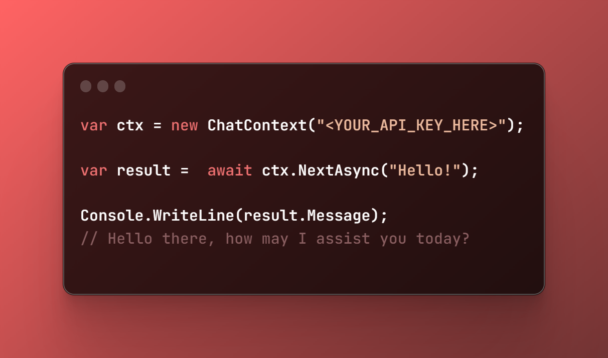

Welcome to ChatGPT.NET, the friendly .NET SDK for using the latest and most powerful chat
model available - the Chat 3.5 Turbo. With our SDK, you can easily integrate the advanced natural
language processing capabilities of the Chat 3.5 Turbo model into your .NET applications, 
enabling your users to engage in more intelligent and personalized conversations.

But that's not all - our SDK also includes support for Whisper Transcription,
allowing you to easily transcribe spoken conversations into text format. 
This feature is especially useful for applications that require real-time 
speech-to-text conversion, such as transcription tools, virtual assistants, and more.

By using our SDK, you can take advantage of all the benefits of the Chat 3.5 Turbo model
and Whisper Transcription, without the need for complex integrations or deep technical knowledge.
Our SDK provides a simple, easy-to-use interface for accessing these advanced features,
making it easy to enhance your applications with cutting-edge natural language processing capabilities.

So why wait? Download our SDK today and start building smarter, 
more personalized applications that can truly engage with your users like never before.

## More In Deep

With this  a powerful  and well-simply .NET SDK that allows you to easily integrate
the OpenAI API into your applications, providing access to state-of-the-art natural
language processing capabilities.
The OpenAI API is a comprehensive and powerful tool that allows developers to leverage
advanced machine learning models for a wide range of natural language processing tasks,
including language translation, sentiment analysis, text completion, and more.

To use the OpenAI API with our SDK, you will need an API key, which can be obtained
from the OpenAI website. Once you have an API key, you can use our SDK to make requests
to the OpenAI API via HTTP endpoints. Our SDK provides a simple, easy-to-use interface
for interacting with the OpenAI API, allowing you to easily access its advanced features
without the need for complex integrations or deep technical knowledge.

One of the key advantages of the OpenAI API is its flexibility and scalability. With a simple
RESTful API and comprehensive documentation, the OpenAI API makes it easy to build sophisticated
natural language processing applications that can scale to handle large volumes of data.
Additionally, the OpenAI API is constantly being updated and improved with the
latest machine learning techniques and algorithms, ensuring that your applications stay at the
cutting edge of natural language processing technology.

### Let's do it easy

